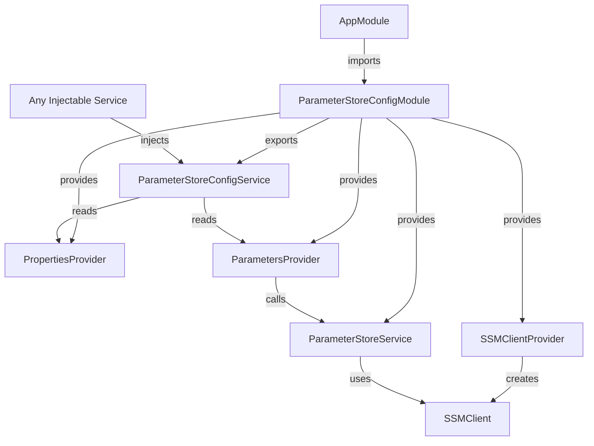
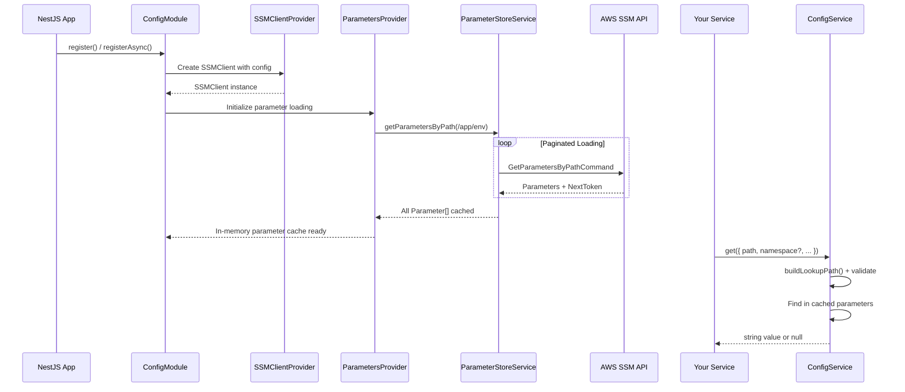

<a id="top"></a>

<p align="center">
  
</p>

<h1 align="center">🔐 NestJS AWS Parameter Store Config</h1>
<p align="center"><em>Seamless NestJS integration with AWS Systems Manager Parameter Store — one canonical SSM contract to rule all your configuration.</em></p>

<p align="center">
    <a aria-label="ElsiKora logo" href="https://elsikora.com">
  
</a>          
</p>

## 💡 Highlights

- 🏗️ Canonical SSM Contract — Enforces a deterministic /<app>/<env>/<namespace>/<instance>/<path> model, eliminating ad-hoc parameter naming chaos across teams
- ⚡ Single Recursive Load — Fetches all parameters under /<app>/<env> at startup into an in-memory cache, serving lookups instantly with zero runtime SSM calls
- 🛡️ Fail-Fast Validation — Catches missing segments, empty strings, whitespace, and illegal '/' characters at boot time with explicit error messages
- 🔌 Broad NestJS Compatibility — Supports NestJS v8 through v11 with both register() and registerAsync() patterns, including factory, class, and existing provider injection

## 📚 Table of Contents
- [Description](#-description)
- [Tech Stack](#-tech-stack)
- [Features](#-features)
- [Architecture](#-architecture)
- [Project Structure](#-project-structure)
- [Prerequisites](#-prerequisites)
- [Installation](#-installation)
- [Usage](#-usage)
- [Roadmap](#-roadmap)
- [FAQ](#-faq)
- [License](#-license)
- [Acknowledgments](#-acknowledgments)

## 📖 Description
Managing application configuration across multiple environments, namespaces, and deployment targets is one of the most error-prone aspects of cloud-native development. **NestJS AWS Parameter Store Config** eliminates that complexity by enforcing a single, canonical SSM path contract:

```
/<application>/<environment>/<namespace>/<instanceName>/<path...>
```

This module provides a first-class NestJS dynamic module that loads all parameters at startup into an in-memory cache, then exposes a type-safe, validated lookup API that resolves paths deterministically.

### Real-World Use Cases

- **Microservices on ECS/EKS**: Each service registers with its own `namespace` and `instanceName`, while sharing infrastructure parameters (database hosts, secret IDs) across namespaces.
- **Multi-Environment Deployments**: Seamlessly switch between `local`, `development`, `staging`, and `production` without changing a single line of application code.
- **Shared Infrastructure Metadata**: A single recursive load from `/<app>/<env>` caches everything — RDS connection strings, Secrets Manager references, CloudWatch config — accessible via simple path lookups.
- **Monorepo / Multi-Service Architectures**: Different services can override `namespace` and `instanceName` per-call, accessing any parameter in the hierarchy without re-registering the module.

With built-in enums for 90+ namespace tokens (AWS, GCP, Azure, databases, message brokers, and more), strict validation that fails fast on misconfigured paths, and support for both synchronous and async module registration, this library turns AWS Parameter Store into a structured, predictable configuration backbone for your NestJS applications.

## 🛠️ Tech Stack

| Category | Technologies |
|----------|-------------|
| **Language** | TypeScript |
| **Runtime** | Node.js |
| **Framework** | NestJS |
| **Cloud** | AWS Systems Manager (SSM) |
| **Build Tool** | Rollup, TypeScript Compiler |
| **Linting** | ESLint, Prettier |
| **CI/CD** | GitHub Actions, Semantic Release |
| **Package Manager** | npm |
| **Code Quality** | Husky, Commitlint, Lint-Staged |

## 🚀 Features
- ✨ ****Canonical Path Contract** — All parameter lookups resolve through a strict `/<application>/<environment>/<namespace>/<instanceName>/<path>` model, ensuring consistency across all services and environments**
- ✨ ****Recursive Parameter Loading** — Loads all parameters under `/<application>/<environment>` at startup using paginated SSM API calls, building an in-memory cache for instant lookups**
- ✨ ****Sync & Async Module Registration** — Supports `register()` for static config and `registerAsync()` with `useFactory`, `useClass`, and `useExisting` patterns for dynamic configuration**
- ✨ ****Per-Call Overrides** — Override `namespace`, `instanceName`, `application`, or `environment` on any individual `get()` call while keeping module-level defaults**
- ✨ ****90+ Built-In Namespace Tokens** — Curated `ENamespace` enum covering AWS, GCP, Azure services, databases, message brokers, observability tools, and more**
- ✨ ****Lifecycle Environment Enum** — `EEnvironment` provides `LOCAL`, `DEVELOPMENT`, `STAGING`, `PRODUCTION`, and `TEST` tokens out of the box**
- ✨ ****Strict Input Validation** — Fails fast with descriptive errors for missing segments, empty strings, whitespace-only values, and segments containing `/`**
- ✨ ****Dual Module Output** — Ships both ESM and CommonJS builds with full TypeScript declarations and source maps**
- ✨ ****Secure Parameter Decryption** — Optional `shouldDecryptParameters` flag enables transparent decryption of SecureString parameters**
- ✨ ****Verbose Logging Mode** — Optional `isVerbose` flag enables detailed NestJS Logger output during parameter loading for debugging**
- ✨ ****Global Module** — Registered as a `@Global()` module, making `ParameterStoreConfigService` injectable anywhere without re-importing**
- ✨ ****Zero Runtime Dependencies** — Peer dependencies only — `@aws-sdk/client-ssm` and `@nestjs/common` are provided by your application**

## 🏗 Architecture

### System Architecture



### Data Flow



## 📁 Project Structure

<details>
<summary>Click to expand</summary>

```
NestJS-AWS-Parameter-Store-Config/
├── .github/
│   ├── workflows/
│   │   ├── mirror-to-codecommit.yml
│   │   ├── qodana-quality-scan.yml
│   │   ├── release.yml
│   │   └── snyk-security-scan.yml
│   └── dependabot.yml
├── src/
│   ├── modules/
│   │   ├── aws/
│   │   └── config/
│   ├── shared/
│   │   ├── constant/
│   │   ├── enum/
│   │   ├── interface/
│   │   └── provider/
│   └── index.ts
├── CHANGELOG.md
├── commitlint.config.js
├── eslint.config.js
├── LICENSE
├── lint-staged.config.js
├── nest-cli.json
├── package-lock.json
├── package.json
├── prettier.config.js
├── README.md
├── release.config.js
├── rollup.config.js
├── tsconfig.build.json
└── tsconfig.json
```

</details>

## 📋 Prerequisites

- Node.js >= 16.0.0
- npm >= 8.0.0
- NestJS >= 8.0.0 (supports v8, v9, v10, v11)
- @aws-sdk/client-ssm >= 3.535.0
- AWS credentials configured (IAM role, environment variables, or AWS CLI profile)
- AWS SSM parameters created following the canonical path convention

## 🛠 Installation
```bash
# Install the package and its required peer dependencies
npm install @elsikora/nestjs-aws-parameter-store-config @aws-sdk/client-ssm @nestjs/common

# Or with Yarn
yarn add @elsikora/nestjs-aws-parameter-store-config @aws-sdk/client-ssm @nestjs/common

# Or with pnpm
pnpm add @elsikora/nestjs-aws-parameter-store-config @aws-sdk/client-ssm @nestjs/common


### Building from Source


# Clone the repository
git clone https://github.com/ElsiKora/NestJS-AWS-Parameter-Store-Config.git
cd NestJS-AWS-Parameter-Store-Config

# Install dependencies
npm install

# Build ESM and CJS outputs
npm run build

# Run linting
npm run lint:all

# Type check
npm run lint:types
```

## 💡 Usage
## Quick Start

### 1. Register the Module

Add `ParameterStoreConfigModule` to your root `AppModule` with your canonical defaults:

```typescript
import { Module } from "@nestjs/common";
import {
  EEnvironment,
  ENamespace,
  ParameterStoreConfigModule,
} from "@elsikora/nestjs-aws-parameter-store-config";

@Module({
  imports: [
    ParameterStoreConfigModule.register({
      application: "gameport",
      environment: EEnvironment.STAGING,
      namespace: ENamespace.AWS_ECS_FARGATE,
      instanceName: "reaper-api",
      shouldDecryptParameters: true,
      config: {
        region: "eu-north-1",
      },
    }),
  ],
})
export class AppModule {}
```

### 2. Async Registration with ConfigService

For dynamic configuration that depends on environment variables or other providers:

```typescript
import { Module } from "@nestjs/common";
import { ConfigModule, ConfigService } from "@nestjs/config";
import {
  EEnvironment,
  ENamespace,
  ParameterStoreConfigModule,
} from "@elsikora/nestjs-aws-parameter-store-config";

@Module({
  imports: [
    ConfigModule.forRoot(),
    ParameterStoreConfigModule.registerAsync({
      imports: [ConfigModule],
      inject: [ConfigService],
      useFactory: (configService: ConfigService) => ({
        application: configService.getOrThrow("APP_NAME"),
        environment: configService.getOrThrow("NODE_ENV"),
        namespace: ENamespace.AWS_ECS_FARGATE,
        instanceName: configService.getOrThrow("SERVICE_NAME"),
        shouldDecryptParameters: true,
        shouldUseRecursiveLoading: true,
        isVerbose: configService.get("VERBOSE") === "true",
        config: {
          region: configService.getOrThrow("AWS_REGION"),
        },
      }),
    }),
  ],
})
export class AppModule {}
```

### 3. Inject and Use the Service

Since the module is `@Global()`, you can inject `ParameterStoreConfigService` in any provider:

```typescript
import { Injectable } from "@nestjs/common";
import {
  ENamespace,
  ParameterStoreConfigService,
} from "@elsikora/nestjs-aws-parameter-store-config";

@Injectable()
export class DatabaseService {
  constructor(
    private readonly config: ParameterStoreConfigService,
  ) {}

  getDatabaseHost(): string {
    // Resolves: /gameport/staging/aws-rds/aurora-postgres/host
    return this.config.get({
      namespace: ENamespace.AWS_RDS,
      instanceName: "aurora-postgres",
      path: ["host"],
    }) ?? "localhost";
  }

  getDatabasePort(): number {
    // Resolves: /gameport/staging/aws-rds/aurora-postgres/port
    const port = this.config.get({
      namespace: ENamespace.AWS_RDS,
      instanceName: "aurora-postgres",
      path: ["port"],
    });
    return port ? parseInt(port, 10) : 5432;
  }
}
```

### 4. Cross-Namespace Lookups

Access parameters from different namespaces without re-registering:

```typescript
@Injectable()
export class AppConfigService {
  constructor(
    private readonly config: ParameterStoreConfigService,
  ) {}

  // Uses module defaults: /gameport/staging/aws-ecs-fargate/reaper-api/api/version
  getApiVersion(): string | null {
    return this.config.get({ path: ["api", "version"] });
  }

  // Override namespace: /gameport/staging/aws-secrets-manager/database/secret-id
  getDatabaseSecretId(): string | null {
    return this.config.get({
      namespace: ENamespace.AWS_SECRETS_MANAGER,
      instanceName: "database",
      path: ["secret-id"],
    });
  }

  // Override everything: /other-app/production/aws-lambda/processor/timeout
  getExternalConfig(): string | null {
    return this.config.get({
      application: "other-app",
      environment: "production",
      namespace: ENamespace.AWS_LAMBDA,
      instanceName: "processor",
      path: ["timeout"],
    });
  }
}
```

### 5. Custom Namespace Strings

Not limited to the built-in enums — pass any string:

```typescript
this.config.get({
  namespace: "custom-service",
  instanceName: "my-instance",
  path: ["some", "deep", "config"],
});
// Resolves: /gameport/staging/custom-service/my-instance/some/deep/config
```

### Configuration Options Reference

| Option | Type | Required | Default | Description |
|--------|------|----------|---------|-------------|
| `application` | `string` | ✅ | — | Product/system name (first path segment) |
| `environment` | `EEnvironment \| string` | ✅ | — | Lifecycle environment token |
| `namespace` | `ENamespace \| string` | ✅ | — | Default owner/runtime/resource token |
| `instanceName` | `string` | ✅ | — | Default deployable unit or resource instance |
| `config` | `SSMClientConfig` | ❌ | `{}` | AWS SSM client configuration |
| `shouldDecryptParameters` | `boolean` | ❌ | `false` | Decrypt SecureString parameters |
| `shouldUseRecursiveLoading` | `boolean` | ❌ | `true` | Recursively load all nested parameters |
| `isVerbose` | `boolean` | ❌ | `false` | Enable verbose logging during parameter loading |

## 🛣 Roadmap

<details>
<summary>Click to expand</summary>

| Task / Feature | Status |
|---|---|
| Canonical SSM path contract (`/<app>/<env>/<ns>/<instance>/<path>`) | ✅ Done |
| Sync and async module registration | ✅ Done |
| Paginated recursive parameter loading | ✅ Done |
| Per-call namespace and instance overrides | ✅ Done |
| Strict input validation with fail-fast errors | ✅ Done |
| Dual ESM/CJS module output with source maps | ✅ Done |
| Built-in ENamespace enum (90+ tokens) | ✅ Done |
| Verbose logging mode | ✅ Done |
| Automated semantic releases with backmerge | ✅ Done |
| TTL-based parameter cache refresh | 🚧 In Progress |
| Parameter change event subscriptions | 🚧 In Progress |
| Batch `getMany()` API for multi-path lookups | 🚧 In Progress |
| Optional Zod/class-validator schema validation on retrieved values | 🚧 In Progress |
| Unit and integration test suite | 🚧 In Progress |

</details>

## ❓ FAQ

<details>
<summary>Click to expand</summary>

### ❓ Frequently Asked Questions

**Q: Does this module make SSM API calls on every `get()` invocation?**

A: No. All parameters are loaded once at module initialization (startup) into an in-memory cache. The `get()` method performs a simple array lookup against the cached parameters — there are zero runtime SSM API calls.

---

**Q: How does the module handle large numbers of parameters?**

A: The `ParameterStoreService` automatically handles SSM API pagination. It continues fetching pages using `NextToken` until all parameters under `/<application>/<environment>` are loaded.

---

**Q: Can I use custom strings instead of the built-in enums?**

A: Yes! Both `environment` and `namespace` accept `string` types in addition to `EEnvironment` and `ENamespace` enums. This allows you to use custom tokens like `"my-custom-namespace"` when the built-in options don't fit.

---

**Q: Which NestJS versions are supported?**

A: The module supports NestJS v8, v9, v10, and v11 through a flexible peer dependency range (`^8.0.0 || ^9.0.0 || ^10.0.0 || ^11.0.0`).

---

**Q: Do I need to import the module in every feature module?**

A: No. `ParameterStoreConfigModule` is decorated with `@Global()`, so once registered in your root `AppModule`, the `ParameterStoreConfigService` is injectable in any provider across your application.

---

**Q: What happens if a required segment (application, environment, etc.) is missing?**

A: The module throws a descriptive error immediately at startup or at lookup time. It validates that no segment is `undefined`, `null`, empty, whitespace-only, or contains `/` characters.

---

**Q: How do I decrypt SecureString parameters?**

A: Set `shouldDecryptParameters: true` in your module registration options. This passes `WithDecryption: true` to the SSM `GetParametersByPathCommand`.

---

**Q: Can I access parameters from a different application or environment?**

A: Yes, but with a caveat. The `get()` method accepts per-call overrides for `application` and `environment`, but the in-memory cache only contains parameters loaded from the module's configured `/<application>/<environment>` prefix. To access parameters from a different prefix, you'd need to register a second module instance or ensure those parameters exist under the loaded prefix.

</details>

## 🔒 License
This project is licensed under **MIT**.

## 🙏 Acknowledgments
## 🙏 Acknowledgments

- [NestJS](https://nestjs.com/) — The progressive Node.js framework that makes building server-side applications a joy
- [AWS SDK for JavaScript v3](https://github.com/aws/aws-sdk-js-v3) — The modular AWS SDK powering the SSM client
- [AWS Systems Manager Parameter Store](https://docs.aws.amazon.com/systems-manager/latest/userguide/systems-manager-parameter-store.html) — The secure, hierarchical configuration storage service
- [Semantic Release](https://github.com/semantic-release/semantic-release) — Fully automated version management and package publishing
- [Rollup](https://rollupjs.org/) — The module bundler enabling dual ESM/CJS output
- [ElsiKora](https://github.com/ElsiKora) — The team behind this module and the broader tooling ecosystem

---

*Built with ❤️ for the NestJS community*

---

<p align="center">
  <a href="#top">Back to Top</a>
</p>